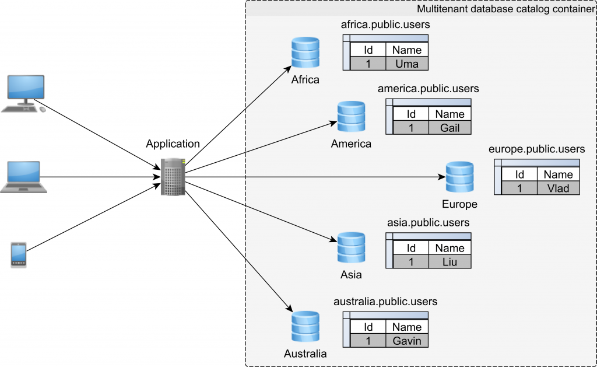

# multitenancy-db

Multi-tenancy using different databases refers to a system where multiple users or organizations or same organization with different regions share a single application or platform, but each user or organization has their own dedicated database for storing their data. This allows for the isolation and separation of data between different users or organizations, ensuring that one user's data cannot be accessed or modified by another user. This approach provides greater security and privacy for each user or organization, while still allowing them to access and utilize the shared application or platform.



Architecture Image Credit : [Vlad](https://twitter.com/vlad_mihalcea)

### Run tests
`$ ./mvnw clean verify`

### Run locally
```
$ docker-compose -f docker/docker-compose.yml up -d
$ ./mvnw spring-boot:run -Dspring-boot.run.profiles=local
```


### Useful Links
* Swagger UI: http://localhost:8080/swagger-ui.html
* Actuator Endpoint: http://localhost:8080/actuator
* PgAdmin : http://localhost:5050
